# UML Class Diagram & OOP Design

## 1. Full Class Diagram

```mermaid
classDiagram
    class Product {
        <<abstract>>
        #String id
        #String name
        #double price
        #String description
        #int stockQuantity
        +calculateDiscount()* double
        +getType()* String
        +getFinalPrice() double
        +getId() String
        +getName() String
        +getPrice() double
        +getDescription() String
        +getStockQuantity() int
        +setStockQuantity(int) void
        +displayInfo() void
    }

    class ElectronicsProduct {
        -String brand
        -int warrantyMonths
        +calculateDiscount() double
        +getType() String
        +displayInfo() void
    }

    class ClothingProduct {
        -String size
        -String color
        -String material
        +calculateDiscount() double
        +getType() String
        +displayInfo() void
    }

    class BookProduct {
        -String author
        -String isbn
        -int pages
        +calculateDiscount() double
        +getType() String
        +displayInfo() void
    }

    class ProductCatalog {
        -List~Product~ products
        +loadFromFile(String) void
        +findById(String) Product
        +getProducts() List~Product~
        +displayAll() void
    }

    class CartItem {
        -Product product
        -int quantity
        +getProduct() Product
        +getQuantity() int
        +setQuantity(int) void
        +getItemTotal() double
    }

    class ShoppingCart {
        -List~CartItem~ items
        -double totalAmount
        +addItem(Product, int) void
        +removeItem(String) void
        +updateQuantity(String, int) void
        -calculateTotal() void
        +displayCart() void
        +isEmpty() boolean
        +clear() void
        +getTotalAmount() double
        +getItems() List~CartItem~
    }

    class Order {
        -double GST_RATE$
        -int orderCounter$
        -String orderId
        -Date orderDate
        -Customer customer
        -ShoppingCart cart
        -double finalAmount
        -String status
        -Date estimatedDelivery
        -snapshotOf(ShoppingCart) ShoppingCart
        -calculateFinalAmount() double
        -calculateDeliveryDate() Date
        +getGstAmount() double
        +displayOrder() void
        +displayConfirmation() void
    }

    class OrderManager {
        -List~Order~ orders
        +placeOrder(Customer, ShoppingCart) Order
        -reduceStock(ShoppingCart) void
        +findByOrderId(String) Order
        +getOrdersByCustomer(String) List~Order~
        +getAllOrders() List~Order~
    }

    class Customer {
        -String customerId
        -String name
        -String email
        -String phone
        -ShoppingCart cart
        +getCustomerId() String
        +getName() String
        +getEmail() String
        +getPhone() String
        +getCart() ShoppingCart
        +displayInfo() void
    }

    class CustomerManager {
        -int customerCounter$
        -List~Customer~ customers
        +registerCustomer(String, String, String) Customer
        +findById(String) Customer
        +findByEmail(String) Customer
        +getCustomers() List~Customer~
    }

    class Main {
        +main(String[]) void
        -registerCustomer() Customer
        -addToCart(ShoppingCart) void
        -updateCart(ShoppingCart) void
        -checkout(Customer, ShoppingCart) void
    }

    Product <|-- ElectronicsProduct : extends
    Product <|-- ClothingProduct : extends
    Product <|-- BookProduct : extends

    ProductCatalog "1" o-- "*" Product : holds
    CartItem "1" --> "1" Product : references
    ShoppingCart "1" *-- "*" CartItem : composed of
    Customer "1" *-- "1" ShoppingCart : owns
    CustomerManager "1" o-- "*" Customer : manages
    Order "1" --> "1" Customer : placed by
    Order "1" *-- "1" ShoppingCart : snapshot
    OrderManager "1" o-- "*" Order : manages
    Main ..> ProductCatalog : uses
    Main ..> CustomerManager : uses
    Main ..> OrderManager : uses
```



---

## 2. Inheritance Hierarchy

```
                        Product  (abstract)
                        ────────────────────
                        id, name, price,
                        description, stockQuantity
                        + calculateDiscount()  ← abstract
                        + getType()            ← abstract
                        + getFinalPrice()      ← concrete, inherited
                        + displayInfo()        ← concrete, overridden
                                 │
            ┌────────────────────┼────────────────────┐
            │                    │                    │
  ElectronicsProduct      ClothingProduct        BookProduct
  ──────────────────      ───────────────        ───────────
  brand                   size                   author
  warrantyMonths          color                  isbn
                          material               pages
  discount = 10%          discount = 15%         discount = 10%
```

**What each subclass inherits:** all five protected fields, every getter/setter, and `getFinalPrice()`.
**What each subclass must supply:** `calculateDiscount()` and `getType()` — the compiler enforces this.
**What each subclass chooses to change:** `displayInfo()`, extended via `super.displayInfo()` plus its own attributes.

---

## 3. Abstraction

`Product` cannot be instantiated — `new Product(...)` is a compile error. It exists to define the contract that every sellable item must honour:

```java
public abstract class Product {
    public abstract double calculateDiscount();
    public abstract String getType();

    public double getFinalPrice() {          // concrete: same rule for all
        return price - calculateDiscount();  // delegates to the subclass
    }
}
```

`getFinalPrice()` is the key line. It is written once in the base class, yet produces a different answer for every product type, because the `calculateDiscount()` it calls is chosen at runtime.

---

## 4. Polymorphism Examples

### 4.1 Runtime method dispatch — one loop, three layouts

`ProductCatalog.displaySection()` iterates a `List<Product>` and calls `displayInfo()`. The JVM picks the override that matches the actual object:

```java
for (Product product : products) {
    if (product.getType().equals(type)) {
        product.displayInfo();   // Electronics / Clothing / Book version
    }
}
```

Output for the same call site:

```
Type: Electronics        Type: Clothing        Type: Book
Brand: TechBrand         Size: M               Author: John Doe
Warranty: 24 months      Color: Blue           ISBN: 978-3-16-148410-0
                         Material: Cotton      Pages: 400
```

### 4.2 Polymorphic pricing in the cart

`CartItem` never asks what kind of product it holds:

```java
public double getItemTotal() {
    return product.getFinalPrice() * quantity;
}
```

| Product | List price | Discount rule applied | Final price |
|---|---|---|---|
| Smartphone X (Electronics) | ₹50000.00 | 10% → ₹5000.00 | ₹45000.00 |
| Cotton T-Shirt (Clothing) | ₹1200.00 | 15% → ₹180.00 | ₹1020.00 |
| Java Programming (Book) | ₹800.00 | 10% → ₹80.00 | ₹720.00 |

### 4.3 Upcasting at construction

`ProductCatalog.parseLine()` returns concrete subclasses but declares `Product` as its return type, so the whole catalogue is stored and passed around as the abstract type:

```java
case "ELECTRONICS":
    return new ElectronicsProduct(id, name, price, description, stock, f[6], warranty);
case "CLOTHING":
    return new ClothingProduct(id, name, price, description, stock, f[6], f[7], f[8]);
case "BOOK":
    return new BookProduct(id, name, price, description, stock, f[6], f[7], pages);
```

### 4.4 Adding a fourth product type

No existing class changes. Create `GroceryProduct extends Product`, implement the two abstract methods, add one `case` to `parseLine()`. The cart, orders and totals keep working — that is the payoff of programming to the abstract type.

---

## 5. Encapsulation

| Access level | Used for | Why |
|---|---|---|
| `protected` | `Product` fields | Subclasses need them; outside code does not |
| `private` | all subclass fields, `ShoppingCart.items`, `Order` fields | Reachable only through methods |
| `private` methods | `calculateTotal()`, `reduceStock()`, `snapshotOf()`, `parseLine()` | Internal steps, not part of the public contract |
| `public` getters | every class | Read access without exposing the field |

`ShoppingCart.totalAmount` can never drift out of sync: it is private and recomputed by `calculateTotal()` inside every mutating method.

---

## 6. Package Diagram

```
com.ecommerce
│
├── Main ──────────────────┐ uses all three managers
│                          │
├── com.ecommerce.products │   Product, ElectronicsProduct, ClothingProduct,
│        ▲   ▲   ▲         │   BookProduct, ProductCatalog
│        │   │   │         │
├── com.ecommerce.cart ────┤   CartItem, ShoppingCart      → depends on products
│        ▲       ▲         │
├── com.ecommerce.customers┤   Customer, CustomerManager   → depends on cart
│        ▲                 │
└── com.ecommerce.orders ──┘   Order, OrderManager         → depends on cart,
                                                              customers, products
```

Dependencies point in one direction only — `products` depends on nothing, and no cycle exists between packages.
